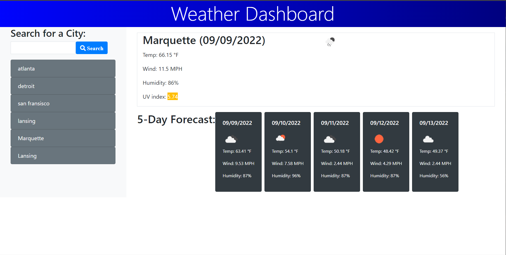

# weatherDashboard
a web-app for seeing weather reports across multiple cities for use by travelers. Built with HTML/CSS Javascript using the bootstrap framework 
and the openweather api. With this app you can search a city get, get the current weather report and a 5 day forecast. Local storage is utilized to 
store the history of cities you have searched.

Live site deployement link: https://mcfoote.github.io/weatherDashboard/

